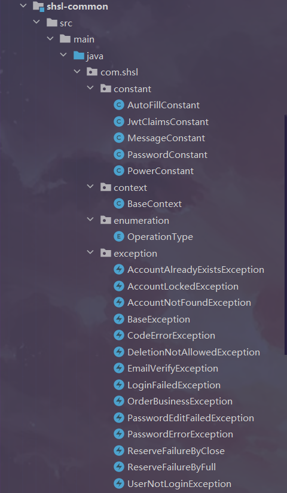
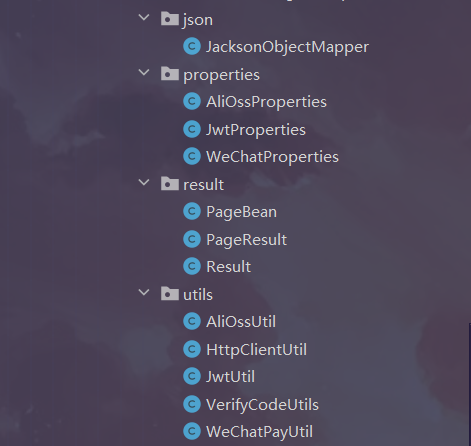
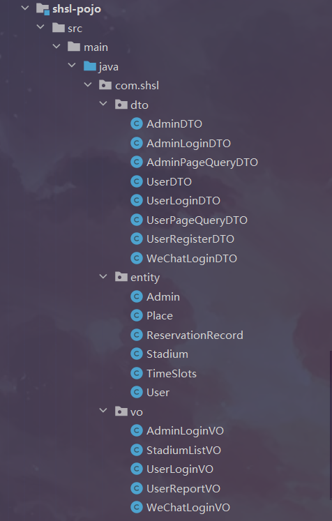
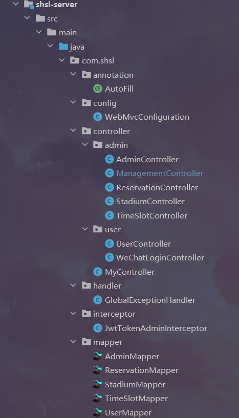
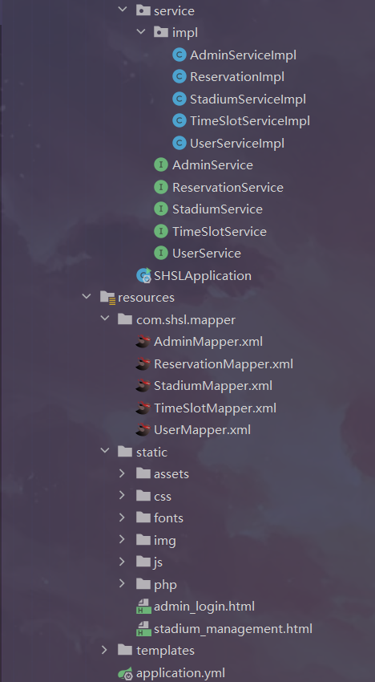
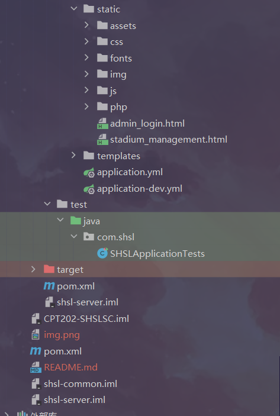

#Gym Booking Application

## Content
* [General info](#general-info)
* [Technologies](#technologies)
* [Cloud Server](#cloud-server)
* [User / Admin Account](#User-/-Admin-Account)
* [Project Structure](#project-structure)

## General info

This project is developed to facilitate the use of the gymnasium by both customers and staff, with a specific focus on creating a reservation system for the super high school gymnasium.  
The aim is to overcome challenges associated with traditional reservation management, such as complex booking processes and lack of transparency in information.  
The system's user-level functions encompass, but are not limited to, the provision of convenient reservation services, management of user personal information, order management and cancellation.  At the staff level, there are managerial functions related to user and site information.  
The overarching requirement is to maximize meeting user needs while ensuring system stability and security, as well as
providing a convenient and easy-to-use operational interface and management tools.

<a href="#top">↥ back to top</a>

## Technologies  

* Java 8
* Spring Boot
* Maven
* Hibernate & Spring Data JPA
* MySQL
* Spring Security
* Thymeleaf
* HTML
* CSS
* JavaScript
* Lombok
* REST
* Postman & Swagger

<a href="#top">↥ back to top</a>

## Cloud Server 
http://121.41.59.88:8080/

<a href="#top">↥ back to top</a>

## User / Admin Account

User: whzy (userName) / 123456 (password)

Admin: hp (adminName) / 11111 (password)

<a href="#top">↥ back to top</a>

## Project Structure

<a href="#top">↥ back to top</a>

